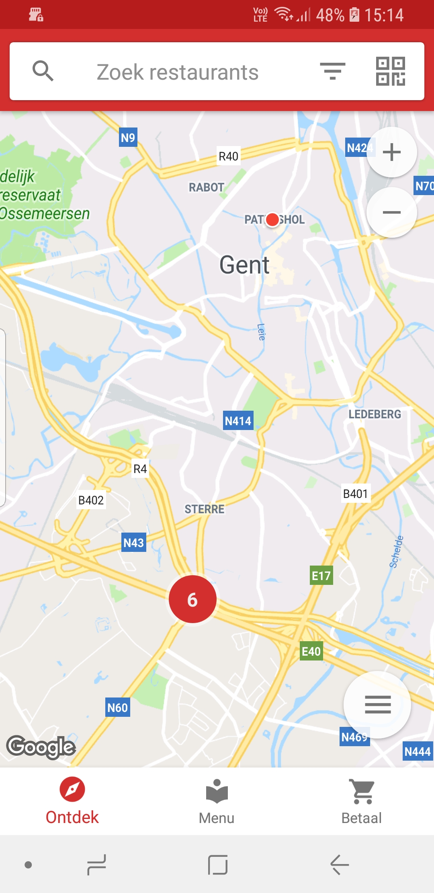
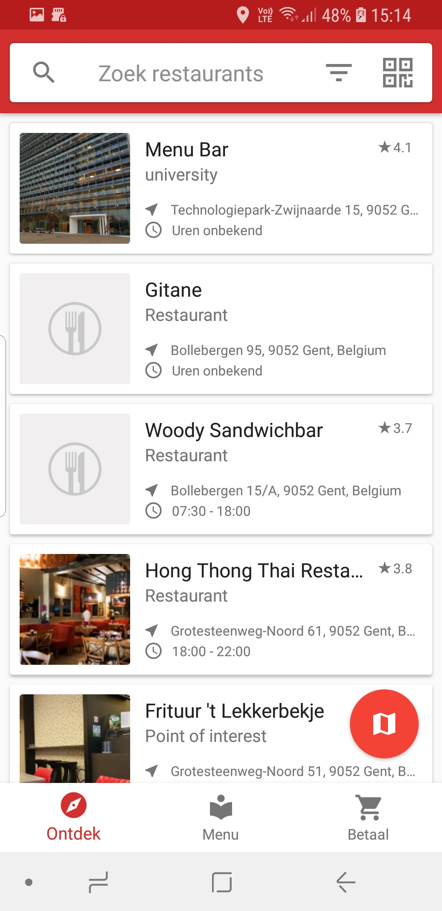
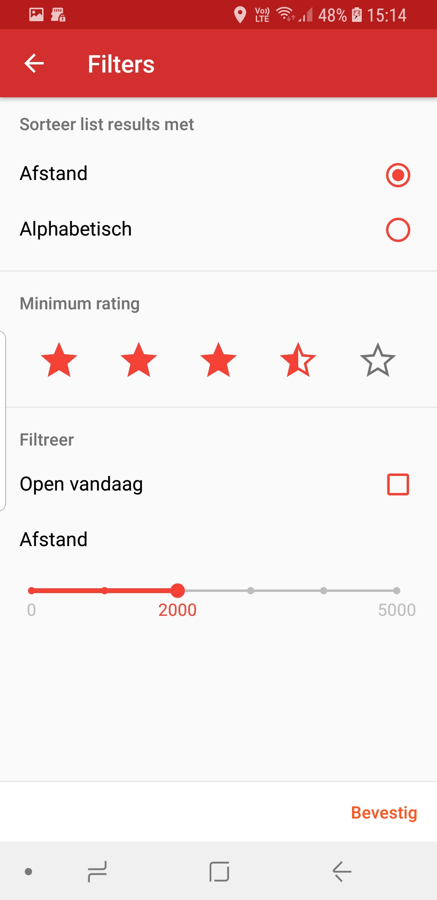
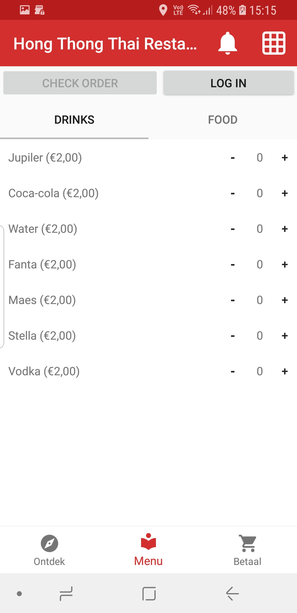

# Restaurant Ordering App (Android)
Group Project for the course Software Engineering Lab 1 (C003780) | 2nd sem 2017 - 2018. Made during my second year of Bachelor of Science in Computer Science at Ghent University.

## Description
This is an android app that allows you to discover restaurants, make an order, call the waiter if you need to and pay your table bill.

## Some Screenshots

## Project members
- Amory Hoste
- Arne Goeteyn
- Dries Marzougui
- Sitt Min Oo
